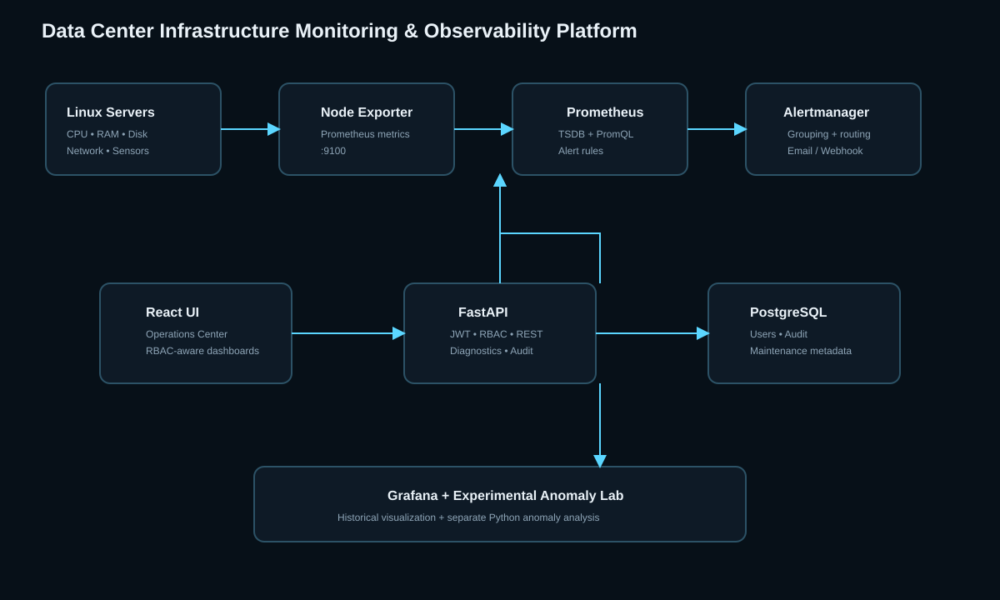

# Data Center Infrastructure Monitoring & Observability Platform

A portfolio-grade DevOps/SRE monitoring platform for Linux infrastructure. It combines **Prometheus + Node Exporter + Alertmanager + Grafana** with a secure **FastAPI + React Operations Center** and PostgreSQL metadata storage.

> **Important:** Prometheus is the source of truth for time-series telemetry. PostgreSQL stores application metadata/audit records. The Anomaly Lab is experimental and clearly separated from deterministic alert rules.

## Architecture

```text
 Linux Servers ── Node Exporter ──> Prometheus ──┬──> Grafana
                                                 └──> Alertmanager ──> Email/Webhook

 React Operations Center <──JWT──> FastAPI <──> PostgreSQL
                                      │
                                      ├── Prometheus API
                                      ├── Alertmanager API
                                      ├── Audit/RBAC
                                      ├── Safe diagnostics
                                      └── Experimental anomaly analysis
```



## Key features

### Observability
- CPU, memory, disk, load, network RX/TX, availability and optional hardware temperature.
- Server inventory with environment/role labels.
- Transparent project-defined health score.
- Prometheus/Grafana historical metrics.
- Explicit DEMO MODE when live targets are unavailable; fake and real telemetry are never silently mixed.

### Alerting
- CPU >70% warning / >90% critical.
- Memory >75% warning / >90% critical.
- Disk >80% warning / >90% critical / >95% emergency.
- Server/Node Exporter down.
- Network errors and drops.
- High load.
- High temperature when a real sensor metric exists.
- Alertmanager grouping, resolved notifications and emergency routing.

### Secure application layer
- FastAPI REST API + OpenAPI docs.
- JWT authentication.
- ADMIN / OPERATOR / VIEWER roles.
- Bcrypt password hashing.
- PostgreSQL metadata database.
- Audit logging.
- Maintenance windows.
- Explicit CORS.
- Environment-based secrets.
- Allowlisted log paths and diagnostic operations.
- No arbitrary shell execution from the frontend.

### React Operations Center
- Dark enterprise/SRE UI.
- Overview KPI cards.
- Server inventory/search.
- Alert management.
- Server metrics view.
- Experimental anomaly lab.
- Audit & logs.
- Maintenance.
- Security/configuration view.
- Responsive design.

### DevOps
- Docker Compose stack with health checks and restart policies.
- Persistent Prometheus, Grafana, Alertmanager and PostgreSQL volumes.
- Production-style Nginx frontend container.
- GitHub Actions for Python tests, frontend build, Docker/config validation.

## Stack

**Python/FastAPI, React/Vite, Prometheus, PromQL, Grafana, Alertmanager, Node Exporter, PostgreSQL, Docker/Compose, Bash, Linux, JWT, REST, Recharts, GitHub Actions.**

## Quick start

```bash
cp .env.example .env
# Change every change-me value for a real deployment.
docker compose up -d --build
docker compose ps
```

Open:
- UI: http://localhost:5173
- API docs: http://localhost:8000/docs
- Prometheus: http://localhost:9090
- Alertmanager: http://localhost:9093
- Grafana: http://localhost:3000

Demo login: `admin / admin`.

## Add Linux servers

Install Node Exporter on each server, then edit `monitoring/prometheus/prometheus.yml`:

```yaml
- job_name: "linux-servers"
  static_configs:
    - targets:
        - "10.0.0.21:9100"
        - "10.0.0.22:9100"
      labels:
        environment: "production"
        role: "application"
```

Restart:

```bash
docker compose restart prometheus
```

Verify in Prometheus → Status → Targets.

## Email notifications

Set these in `.env`:

```text
SMTP_SMARTHOST=smtp.example.com:587
SMTP_FROM=monitor@example.com
SMTP_AUTH_USERNAME=monitor@example.com
SMTP_AUTH_PASSWORD=...
ALERT_EMAIL_TO=ops@example.com
```

Then:

```bash
docker compose up -d --force-recreate alertmanager
```

## Ubuntu deployment

1. Install Docker Engine + Compose.
2. Clone the repository.
3. Configure `.env` with unique secrets.
4. Restrict ports with UFW/security groups.
5. Install Node Exporter on monitored servers.
6. Add Prometheus targets.
7. Put the UI/API behind HTTPS.
8. Back up PostgreSQL and monitoring volumes.

See [INSTALLATION.md](INSTALLATION.md), [SECURITY.md](SECURITY.md) and [TROUBLESHOOTING.md](TROUBLESHOOTING.md).

## Validation

```bash
docker compose config
docker compose up -d --build
curl http://localhost:8000/health
```

Backend tests:

```bash
cd backend
pytest -q
```

Frontend build:

```bash
cd frontend
npm install
npm run build
```

## Project documentation

- [ARCHITECTURE.md](ARCHITECTURE.md)
- [INSTALLATION.md](INSTALLATION.md)
- [API.md](API.md)
- [SECURITY.md](SECURITY.md)
- [TROUBLESHOOTING.md](TROUBLESHOOTING.md)
- [INTERVIEW_GUIDE.md](INTERVIEW_GUIDE.md)
- [DEMO_GUIDE.md](DEMO_GUIDE.md)

## Resume-ready description

**Data Center Infrastructure Monitoring & Observability Platform | Python, FastAPI, React, Prometheus, Grafana, Docker, PostgreSQL**

Built an enterprise-style Linux infrastructure monitoring platform using Prometheus and Node Exporter for real-time telemetry, Alertmanager for severity-based alert routing, Grafana for historical observability, and a React/FastAPI Operations Center with JWT/RBAC, audit logging, safe diagnostics, maintenance windows and an experimental anomaly-detection module.


## future work

- Kubernetes and Windows Exporter monitoring.
- Service discovery instead of static targets.
- OIDC/SSO.
- SSH connector with a dedicated least-privilege service account.
- Real rolling z-score/Isolation Forest anomaly models.
- Long-term metrics via remote_write.
- Slack/Teams/PagerDuty gateways.
